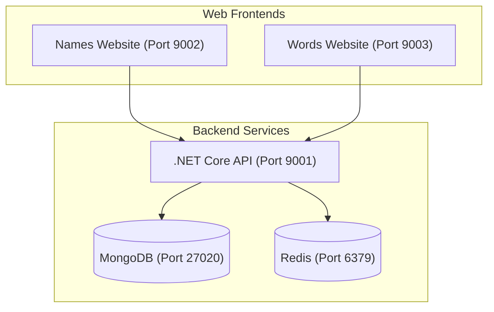

# Yoruba Name Dictionary

Welcome to the Yoruba Name Dictionary! This repository contains the modern implementation of the Yoruba Name project, including a public Website, an API, and a Words dictionary.

## Architecture Overview



- The **Names Website** interacts with the API to deliver its functionality.
- The **Words Website** provides a dictionary of Yoruba words.
- The **API** is cross-platform (.NET 8) and supports multiple language collections beyond Yoruba (e.g., Igbo).
- The **Admin Dashboard** (Legacy) is the primary tool for managing entries and is found in the [yorubaname-dashboard](https://github.com/Yorubaname/yorubaname-dashboard) repository.

## Table of Contents
- [Projects](#projects)
- [Prerequisites](#prerequisites)
- [Setup and Running Locally](#setup-and-running-locally)
- [Twitter Integration & Background Jobs](#twitter-integration-background-jobs)
- [Testing](#testing)
- [Migration Tools](#migration-tools)
- [Contributing](#contributing)
- [Contact Information](#contact-information)

## Projects

### 1. Website
The Website project is the end-user-facing frontend of the application that communicates with the API to deliver the service to the users.

### 2. API
The API project handles the backend logic and data management, providing endpoints for the Website to consume. It uses a MongoDB database for data persistence.

## Prerequisites

To run this project locally, you will need to have installed:

- **Docker Desktop** (Recommended) or Docker Engine with Docker Compose.
- **Visual Studio 2022** (.NET 8.0 support) - *Optional if using Docker CLI*.

## Setup and Running Locally

There are two main ways to run the project locally.

### Option A: Using Docker CLI (Recommended)

This is the fastest way to get the entire stack (API, Websites, DB, Cache) running without manual installation of dependencies.

1. **Clone the repository.**
2. **Navigate to the root directory.**
3. **Run the startup command:**
   ```bash
   docker compose up --build -d
   ```
4. **Monitor logs:**
   ```bash
   docker compose logs -f api
   ```

### Option B: Using Visual Studio

1. **Open the project in Visual Studio:**
    - Open Visual Studio.
    - Click on `Open a project or solution`.
    - Navigate to the cloned repository folder and select the `YorubaNameDictionary.sln` file.

2. **Set Docker Compose as the Startup project:**
    - In the Solution Explorer, locate the `docker-compose` project.
    - Right-click on the `docker-compose` project and select `Set as Startup Project`.

3. **Run the Docker Compose project:**
    - Click on the `Start` button (or press `F5`) to build and run the application.

## Accessing the Application

Once the Docker containers are up and running, you can access the following services:

| Service | Local URL | Port |
| :--- | :--- | :--- |
| **Names Website** | [http://localhost:9002](http://localhost:9002) | 9002 |
| **Words Website** | [http://localhost:9003](http://localhost:9003) | 9003 |
| **Backend API (Swagger)** | [http://localhost:9001/swagger](http://localhost:9001/swagger) | 9001 |
| **Hangfire Dashboard** | [http://localhost:9001/backJobMonitor](http://localhost:9001/backJobMonitor) | 9001 |

- **API Authentication**: You can login to the API with any username from [the database initialization script](./mongo-init.js) and password: **Password@135**.

## macOS & Linux Specifics

If running on macOS or Linux, a `.env` file is required to provide default values for variables often provided by Visual Studio on Windows.

1. Create a `.env` file in the root directory:
   ```bash
   APPDATA=.
   YND_Twitter__ConsumerKey=
   YND_Twitter__ConsumerSecret=
   YND_Twitter__AccessToken=
   YND_Twitter__AccessTokenSecret=
   ```
2. Volume mounts for `UserSecrets` and `Https` in `docker-compose.override.yml` should be commented out or adjusted for non-Windows paths.

## Twitter Integration & Background Jobs

The project uses **Hangfire** to manage background tasks, such as scheduled tweets for new name entries.

- **Configuration**: Twitter API credentials should be added to your `.env` file (see above) or via environment variables.
- **Monitoring**: Once the API is running, you can monitor background jobs at [http://localhost:9001/backJobMonitor](http://localhost:9001/backJobMonitor).

## Testing

The project includes a suite of unit and integration tests to ensure stability.

### Running Tests via CLI
To run all tests from the root of the repository:
```bash
dotnet test
```

### Running Tests in Visual Studio
- Open the `Test Explorer` (`Test` > `Test Explorer`).
- Click `Run All Tests` to execute the suite.

## Migration Tools

For developers moving data from the legacy MySQL-based system to the modern MongoDB architecture, a specialized toolkit is available:

- **Folder**: [`Data-Migration-SQL-to-Json/`](./Data-Migration-SQL-to-Json/)
- **Purpose**: Contains Python scripts and utilities to extract data from a SQL dump and transform it into the JSON format required for MongoDB ingestion.

## Contributing

Contributions are welcome! Please fork the repository and create a pull request for any feature or bug fix. Ensure your code adheres to the existing style.

## Contact Information
If you have any questions about the project or need more information/support to contribute to the project, feel free to reach out to the:
- Main developer: hoadewuyi@gmail.com
- Organization email: project@yorubaname.com
